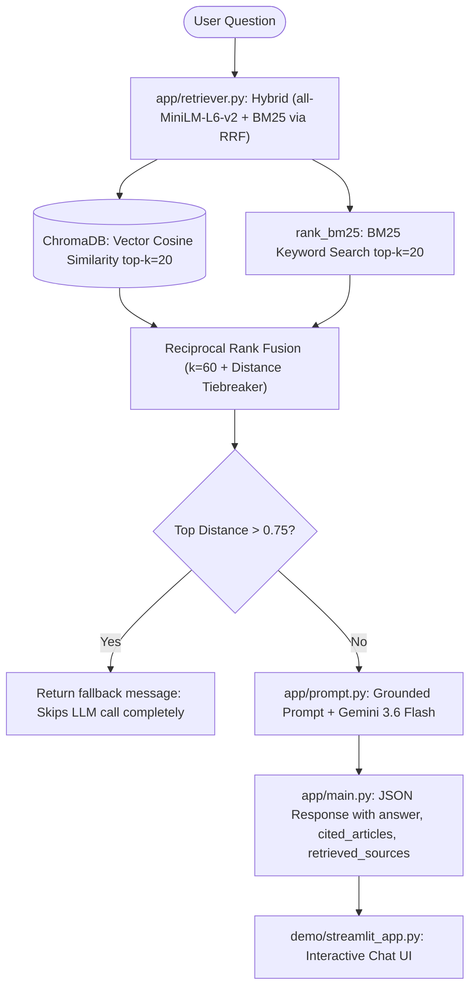

# Constitution of India — Domain-Locked RAG Chatbot

A domain-locked Retrieval-Augmented Generation (RAG) assistant that strictly answers legal queries from the official **Constitution of India**, cites verified Article numbers, and rejects out-of-scope queries using distance guardrails.

---

## 🏛️ System Architecture



---

## 📂 Project Structure

```
.
├── data/
│   ├── constitution.pdf          # Official Constitution of India PDF (diglot edition)
│   ├── constitution_raw.txt      # Raw extracted text from PDF
│   ├── articles_chunked.json     # 531 extracted article chunks (includes previously-missing articles like 21A, 72, and GST/municipal provisions recovered via a chunking regex fix)
│   └── overview_chunks.json      # 5 hand-written overview chunks for broad/summary topics
├── ingestion/
│   ├── extract_text.py           # Extracts text from PDF to constitution_raw.txt
│   └── chunk_by_article.py       # Regex chunking into articles (tags main_body vs amendment_act)
├── scripts/
│   ├── check_chunks.py           # Diagnostic verification script for chunk quality
│   └── test_ask.py               # Test script sending queries to the FastAPI /ask endpoint
├── embeddings/
│   └── build_index.py            # Embeds articles + overview chunks into local ChromaDB
├── app/
│   ├── main.py                   # FastAPI backend with /ask and /health endpoints
│   ├── retriever.py              # Hybrid retriever (MiniLM vector + BM25 keyword search via RRF)
│   └── prompt.py                 # Gemini prompt construction, grounding, & citation parser
├── eval/
│   ├── qa_pairs.json             # 25 benchmark QA pairs across constitutional topics
│   └── run_eval.py               # Evaluation benchmark script measuring Top-1 and Top-k accuracy
├── demo/
│   └── streamlit_app.py          # Streamlit chat interface with citation badges & source inspector
├── requirements.txt              # Project dependencies
├── .env.example                  # Environment variable template
├── .gitignore                    # Git ignore file for secrets, venv, and vector DB
└── README.md
```

---

## 🚀 Setup & Installation

### 1. Clone & Environment Setup

Clone the repository and set up a Python virtual environment:

```powershell
# Windows (PowerShell)
git clone <repository-url>
cd RAG
python -m venv venv
.\venv\Scripts\Activate.ps1
```

```bash
# macOS / Linux
git clone <repository-url>
cd RAG
python3 -m venv venv
source venv/bin/activate
```

Install the dependencies:

```powershell
pip install -r requirements.txt
```

### 2. Configure Gemini API Key

Copy `.env.example` to `.env` and set your Google Gemini API key:

```powershell
Copy-Item .env.example .env
```

Edit `.env`:
```env
GEMINI_API_KEY=your_actual_gemini_api_key_here
```

---

## 🔄 Running the Ingestion & Embedding Pipeline

*(Note: Pre-extracted chunks in `data/` and the `chroma_db/` index are included, but you can regenerate them anytime)*

Run the pipeline steps in order:

1. **Extract text from the source PDF**:
   ```powershell
   python ingestion/extract_text.py
   ```

2. **Chunk into structured articles**:
   ```powershell
   python ingestion/chunk_by_article.py
   ```

3. **Verify chunk quality & integrity**:
   ```powershell
   python scripts/check_chunks.py
   ```

4. **Build the persistent vector index in ChromaDB**:
   ```powershell
   python embeddings/build_index.py
   ```
   *(Loads both `data/articles_chunked.json` and `data/overview_chunks.json`, indexing 536 total vectors).*

---

## ⚡ Starting the FastAPI Backend

Launch the FastAPI backend with Uvicorn:

```powershell
uvicorn app.main:app --reload --port 8000
```

- **Base URL:** `http://127.0.0.1:8000`
- **Interactive Swagger Docs:** `http://127.0.0.1:8000/docs`
- **Health Check:** `http://127.0.0.1:8000/health`

### Quick API Verification

In another terminal, test the `/ask` endpoint using the test script:

```powershell
python scripts/test_ask.py
```

Or via `curl` / PowerShell:
```powershell
Invoke-RestMethod -Method Post -Uri "http://127.0.0.1:8000/ask" `
  -Headers @{"Content-Type"="application/json"} `
  -Body '{"question": "What does Article 21 say?"}'
```

**Response format**:
```json
{
  "answer": "According to Article 21, no person shall be deprived of his life or personal liberty except according to procedure established by law.",
  "cited_articles": ["21"],
  "retrieved_sources": [
    {
      "article_number": "21",
      "title": "Protection of life and personal liberty",
      "distance": 0.4662
    }
  ]
}
```

---

## 🖥️ Running the Streamlit Demo UI

With the FastAPI server running, launch the interactive Streamlit interface:

```powershell
streamlit run demo/streamlit_app.py
```

Navigate to `http://localhost:8501`. Features include:
- Backend health status indicator
- Clickable sample queries for common constitutional topics
- Formatted answers with verified article citation tags
- Collapsible source cards displaying retrieved context articles and cosine distances

---

## 📊 Evaluation Benchmark

Run the automated retrieval evaluation over the 25 benchmark QA pairs:

```powershell
python eval/run_eval.py
```

### Benchmark Results (Hybrid Search with MiniLM + BM25 + RRF)
- **Top-1 Retrieval Accuracy:** **84.0%** (21/25)
- **Top-5 Retrieval Accuracy:** **100.0%** (25/25)

### Configuration Comparison

| Configuration | Embedding Model | Retrieval Method | Top-1 Accuracy | Top-5 Accuracy | Index Build Time |
|---|---|---|---|---|---|
| **Original Baseline** | `all-MiniLM-L6-v2` | Pure Vector | 19/25 (76.0%) | 23/25 (92.0%) | ~8.0s |
| **Pure Vector (mpnet)** | `all-mpnet-base-v2` | Pure Vector | 16/25 (64.0%) | 22/25 (88.0%) | 65.4s |
| **Hybrid (mpnet)** | `all-mpnet-base-v2` | Vector + BM25 + RRF | 18/25 (72.0%) | 23/25 (92.0%) | 65.4s |
| **Hybrid (MiniLM)** | `all-MiniLM-L6-v2` | Vector + BM25 + RRF | 20/25 (80.0%) | 23/25 (92.0%) | ~6.0s |
| **Hybrid (MiniLM) + chunking fix ⭐** | `all-MiniLM-L6-v2` | Vector + BM25 + RRF, fixed chunking regex | **21/25 (84.0%)** | **25/25 (100.0%)** | **~7s** |

---

## 🛡️ Guardrails & Known Limitations

1. **Strict Domain-Locking**: System prompt strictly forbids the model from extrapolating or using outside knowledge. All answers must be directly grounded in the retrieved excerpts.
2. **Deterministic Out-of-Scope Fallback**: If the cosine distance of the closest retrieved chunk exceeds `0.75`, the query is flagged as out-of-scope and the LLM call is bypassed entirely, returning `"I don't have information on that in the Constitution."`
3. **Broad/Vague Query Handling**: The bot is intentionally designed to decline broad, vague, or subjective questions that cannot be grounded in a specific constitutional article or overview chunk, rather than risk hallucinations.
4. **Overview Chunks**: To support summary questions that span multiple provisions (such as "What are the important articles for Indian citizens?"), curated overview chunks (`data/overview_chunks.json`) cover Fundamental Rights, Duties, Directive Principles, Government Structure, and Constitutional Amendments.
5. **Amendment Disambiguation**: Chunks originating from Amendment Acts are labeled with `source: amendment_act` and de-prioritized in favor of main body articles for identical article numbers.
6. **Chunking Regex Fix & Complete Article Ingestion**: A chunking regex bug initially caused 122 articles (including 21A and 72) to be silently merged into adjacent articles rather than indexed separately. Fixing the regex to handle footnote-prefixed article numbers and abbreviation-containing titles recovered all missing articles and raised Top-5 retrieval accuracy from 92% to 100%.
