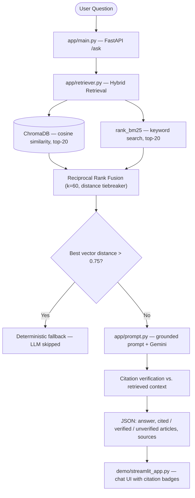

# Constitution of India — Domain-Locked RAG Assistant


A retrieval-augmented generation (RAG) assistant that answers legal queries **strictly from the official Constitution of India**, cites article numbers **verified against the retrieved context**, and deterministically rejects out-of-scope queries — no LLM call, no hallucinated answers.

**Benchmark: 84% Top-1 / 100% Top-5 retrieval accuracy** across 25 curated QA pairs.

---

## Features

- **Hybrid retrieval** — dense vector search (all-MiniLM-L6-v2 via ChromaDB) fused with BM25 keyword search through Reciprocal Rank Fusion (k=60)
- **Citation verification** — every article citation in an answer is checked against the retrieved context; unverified citations are flagged in the API response and the UI
- **Deterministic out-of-scope guardrail** — queries whose best vector match exceeds a cosine distance of 0.75 are answered with a fixed fallback, skipping the LLM entirely
- **Amendment disambiguation** — chunks from appended Amendment Acts are tagged and de-prioritized in favor of main-body articles
- **Interactive demo UI** — Streamlit chat with health indicator, sample queries, ✅/⚠️ citation badges, and a source inspector
- **Evaluated** — reproducible retrieval benchmark with 25 hand-crafted QA pairs and a configuration comparison history

## System Architecture



## Project Structure

```
.
├── data/
│   ├── constitution.pdf          # Official Constitution of India PDF (diglot edition)
│   ├── constitution_raw.txt      # Raw extracted text from PDF
│   ├── articles_chunked.json     # 531 article chunks (incl. 21A, 72, GST/municipal provisions)
│   └── overview_chunks.json      # 5 curated overview chunks for broad/summary topics
├── ingestion/
│   ├── extract_text.py           # PDF → constitution_raw.txt
│   └── chunk_by_article.py       # Regex chunking into articles (main_body vs amendment_act)
├── embeddings/
│   └── build_index.py            # Embeds chunks into the local ChromaDB index
├── app/
│   ├── main.py                   # FastAPI backend (/ask, /health)
│   ├── retriever.py              # Hybrid retriever (MiniLM vector + BM25 via RRF)
│   └── prompt.py                 # Gemini prompt construction, citation parsing & verification
├── eval/
│   ├── qa_pairs.json             # 25 benchmark QA pairs across constitutional topics
│   └── run_eval.py               # Retrieval benchmark (Top-1 / Top-k accuracy)
├── demo/
│   └── streamlit_app.py          # Streamlit chat interface
├── scripts/
│   ├── check_chunks.py           # Chunk quality diagnostics
│   └── test_ask.py               # Manual smoke test for the /ask endpoint
├── tests/
│   └── test_rag.py               # Unit tests (citation parsing, guardrails, fusion, chunker)
├── docs/                         # Screenshots used in this README
├── requirements.txt
├── .env.example                  # Environment variable template
└── README.md
```

## Quickstart

### 1. Clone and set up a virtual environment

```bash
git clone <repository-url>
cd RAGpanchayat

# Windows (PowerShell)
python -m venv venv
.\venv\Scripts\Activate.ps1

# macOS / Linux
python3 -m venv venv
source venv/bin/activate
```

Install dependencies:

```bash
pip install -r requirements.txt
```

### 2. Configure environment variables

```bash
cp .env.example .env   # Windows: Copy-Item .env.example .env
```

Edit `.env`:

```env
GEMINI_API_KEY=your_actual_gemini_api_key_here
```

| Variable | Required | Default | Description |
|---|---|---|---|
| `GEMINI_API_KEY` | Yes | — | Google Gemini API key ([get one here](https://aistudio.google.com/apikey)) |
| `GEMINI_MODEL` | No | `gemini-3.6-flash` | Generation model identifier |
| `ALLOWED_ORIGINS` | No | `http://localhost:8501,http://127.0.0.1:8501` | CORS allow-list for the backend |
| `ENABLE_BM25` | No | `1` | Set to `0` to disable the keyword channel (pure vector mode) |
| `BACKEND_API_URL` | No | `http://127.0.0.1:8000/ask` | Backend URL used by the Streamlit demo |

## Ingestion & Embedding Pipeline

Pre-extracted chunks and the vector index are included in the repository, but the pipeline can be regenerated end-to-end:

```bash
python ingestion/extract_text.py      # 1. Extract text from the source PDF
python ingestion/chunk_by_article.py  # 2. Chunk into structured articles
python scripts/check_chunks.py        # 3. Verify chunk quality & integrity
python embeddings/build_index.py      # 4. Build the ChromaDB index (536 vectors)
```

## Running the Backend

```bash
uvicorn app.main:app --reload --port 8000
```

- **Base URL:** http://127.0.0.1:8000
- **Interactive docs:** http://127.0.0.1:8000/docs
- **Health check:** http://127.0.0.1:8000/health

### API Reference

| Method | Endpoint | Description |
|---|---|---|
| `POST` | `/ask` | Answer a question grounded in the Constitution |
| `GET` | `/health` | Service health check |

**Request:**

```json
{ "question": "What does Article 21 say?" }
```

**Response:**

```json
{
  "answer": "According to Article 21, no person shall be deprived of his life or personal liberty except according to procedure established by law.",
  "cited_articles": ["21"],
  "verified_articles": ["21"],
  "unverified_articles": [],
  "retrieved_sources": [
    {
      "article_number": "21",
      "title": "Protection of life and personal liberty",
      "distance": 0.4662,
      "retrieval": "hybrid"
    }
  ]
}
```

`retrieved_sources[].distance` is the cosine distance (lower is better). Sources found exclusively by the BM25 keyword channel are marked `"retrieval": "keyword_only"` and have no vector distance. Quick smoke test against a running server:

```bash
python scripts/test_ask.py
```

## Running the Demo UI

With the backend running:

```bash
streamlit run demo/streamlit_app.py
```

Then open http://localhost:8501. The UI shows backend health, clickable sample queries, answers with ✅/⚠️ citation badges, and collapsible source cards with distances.

## Running with Docker

```bash
cp .env.example .env    # then set GEMINI_API_KEY
docker compose up --build
```

- **FastAPI backend:** http://localhost:8000 (container `backend`, health-checked)
- **Streamlit frontend:** http://localhost:8501 (container `streamlit`, starts only after the backend is healthy)

Stop with `docker compose down`.

## Testing

The backend ships with a unit-test suite that runs offline (no model download, no API calls):

```bash
python -m unittest discover -s tests -v
```

Coverage includes citation parsing (lists, sub-articles, compound suffixes such as `243ZG`), citation verification, the distance guardrail's keyword-only exemption, RRF fusion and deduplication, and the chunker's footnote filter.

## Evaluation Benchmark

```bash
python eval/run_eval.py
```

**Current configuration** (Hybrid MiniLM + BM25 + RRF, fixed chunking regex):

- **Top-1 Retrieval Accuracy: 21/25 (84.0%)**
- **Top-5 Retrieval Accuracy: 25/25 (100.0%)**

### Configuration Comparison

| Configuration | Embedding Model | Retrieval Method | Top-1 Accuracy | Top-5 Accuracy | Index Build Time |
|---|---|---|---|---|---|
| Original baseline | `all-MiniLM-L6-v2` | Pure vector | 19/25 (76.0%) | 23/25 (92.0%) | ~8.0s |
| Pure vector (mpnet) | `all-mpnet-base-v2` | Pure vector | 16/25 (64.0%) | 22/25 (88.0%) | 65.4s |
| Hybrid (mpnet) | `all-mpnet-base-v2` | Vector + BM25 + RRF | 18/25 (72.0%) | 23/25 (92.0%) | 65.4s |
| Hybrid (MiniLM) | `all-MiniLM-L6-v2` | Vector + BM25 + RRF | 20/25 (80.0%) | 23/25 (92.0%) | ~6.0s |
| **Hybrid (MiniLM) + chunking fix** | `all-MiniLM-L6-v2` | Vector + BM25 + RRF, fixed chunking regex | **21/25 (84.0%)** | **25/25 (100.0%)** | **~7s** |

## Guardrails & Design Notes

1. **Strict domain locking** — the system prompt forbids the model from using outside knowledge; answers must be grounded in the retrieved excerpts.
2. **Deterministic out-of-scope fallback** — the cosine-distance threshold (0.75) applies to vector distances. If nothing relevant survives, the fixed fallback is returned without an LLM call.
3. **Keyword-only exemption** — chunks surfaced *only* by BM25 are exempt from the distance threshold (they have no vector distance); this preserves exactly the exact-term recall that motivates hybrid search.
4. **Citation verification** — parsed citations are checked against the retrieved context and reported as `verified_articles` / `unverified_articles`. This is a heuristic string match against retrieval, not a substitute for reading the underlying text; the UI surfaces ⚠️ warnings for unverified citations.
5. **Broad/vague query handling** — the assistant intentionally declines subjective questions that cannot be grounded in a specific article or overview chunk.
6. **Overview chunks** — five curated chunks cover cross-cutting topics (Fundamental Rights, Duties, Directive Principles, Government Structure, Amendments).
7. **Amendment disambiguation** — Amendment Act chunks are labeled `source: amendment_act` and de-prioritized against main-body articles with the same number.
8. **Complete article ingestion** — an early chunking-regex bug silently merged 122 articles (including 21A and 72) into neighbors; the fixed regex recovered all of them and raised Top-5 accuracy from 92% to 100%.

## Security Notes

- API keys live only in `.env`, which is gitignored; `.env.example` contains placeholders only.
- The backend CORS policy defaults to the local Streamlit origin; extend it with `ALLOWED_ORIGINS` when deploying.
- The `/ask` endpoint performs no rate limiting or authentication — place it behind a gateway before exposing it publicly.

## License

Released under the [MIT License](LICENSE).
